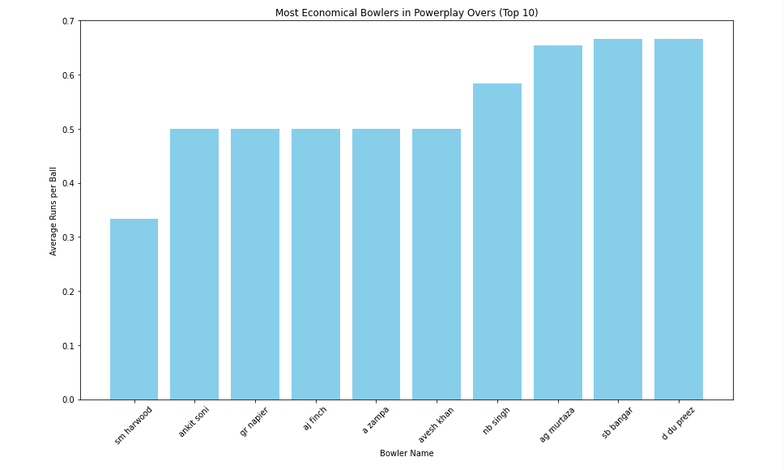
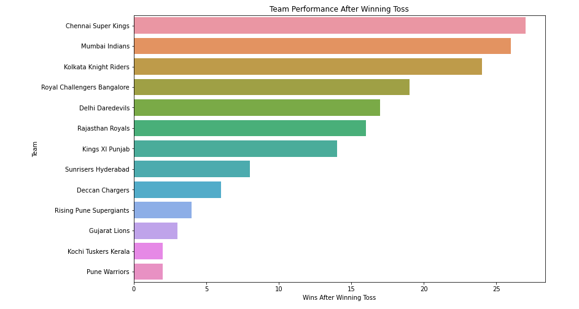
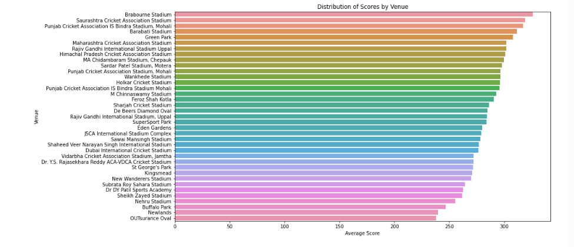
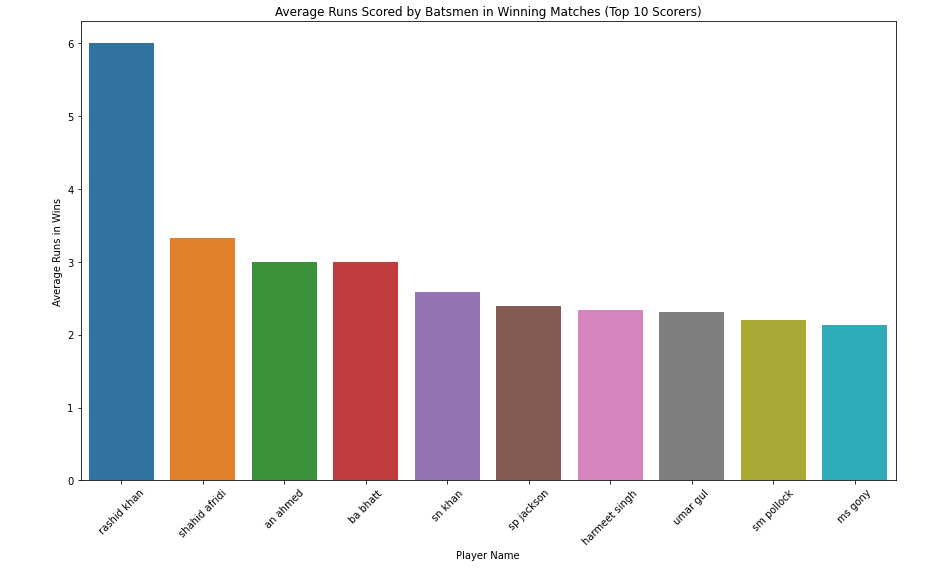
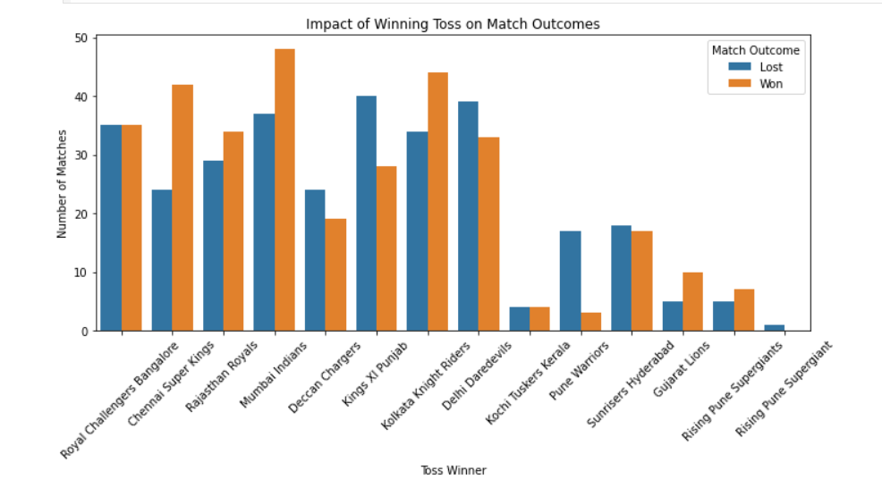
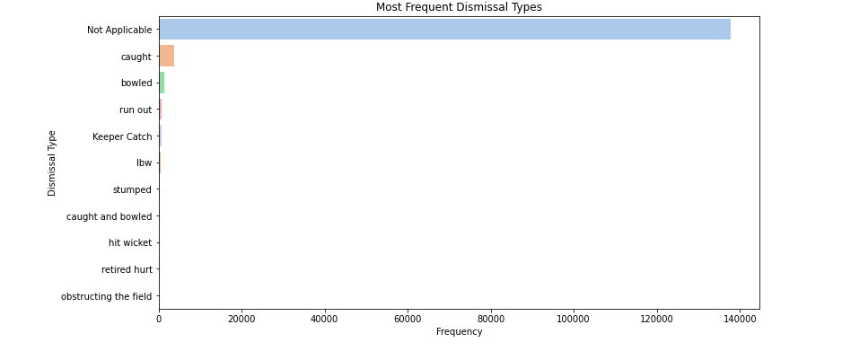

# 🏏 IPL Data Analysis using PySpark

This project performs exploratory data analysis on IPL (Indian Premier League) datasets using **PySpark**, focusing on key player stats, team performance, and season trends. The analysis includes interactive visualizations and is designed for big data scalability.

## 📁 Project Structure

```
ipl_pyspark/
├── data/                         # Raw IPL CSV files
├── scripts/
│   └── ipl_analysis.py           # Python script for full PySpark analysis
├── ipl_analysis.ipynb           # Jupyter Notebook version of the analysis
├── output/                       # Plots and visual outputs
│   ├── top_batsmen.png
│   ├── top_bowlers.png
│   └── matches_per_season.png
└── README.md                     # Project documentation
```

## 📊 Key Analysis Highlights

- Top Batsmen and Bowlers of all seasons
- Team-wise win distribution and toss analysis
- Match count per season
- Venue performance and win patterns
- Visualized insights using `matplotlib` and `PySpark`

## 📊 IPL Dashboard Previews

<p align="center">
  
  
  <br><br>
  
  
  <br><br>
  
  
</p>


## ⚙️ Tech Stack

- **Language**: Python 3
- **Framework**: Apache Spark (PySpark)
- **Libraries**: Pandas, Matplotlib, PySpark
- **Tools**: Jupyter Notebook, VS Code, CLI

## 🚀 How to Use

### 1. Clone the Repository

```bash
git clone https://github.com/richanshu14/ipl_pyspark.git
cd ipl_pyspark
```

### 2. Install Required Libraries

```bash
pip install pyspark pandas matplotlib
```

### 3. Run via Jupyter Notebook

```bash
jupyter notebook
```

Open `ipl_analysis.ipynb` in the browser.

### 4. Or Run via Spark Submit

```bash
spark-submit scripts/ipl_analysis.py
```

## 📌 Use Cases

- Sports analytics portfolio project
- Learning PySpark and big data workflows
- Resume project for data engineering or analytics roles

## 🧑‍💻 Author

**Richanshu Yadav**  
[GitHub Profile](https://github.com/richanshu14)


